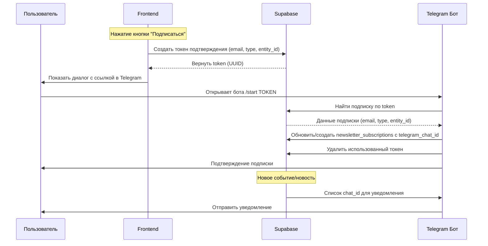

# План реализации Telegram бота для подписки на новости

## Обзор

**API ключ бота:** `8476283888:AAGLzWghKR2n1ynv5Hgvu0eooOdig7oM7jg`

**Функциональность:**
- Подписка на общие новости/события портала (кнопка на главной)
- Подписка на обновления конкретного производителя (кнопка на карточке)
- Отправка уведомлений через Telegram при новых событиях

---

## 1. Миграция базы данных

### 1.1 Добавить поле `telegram_chat_id` в таблицу подписок

```sql
ALTER TABLE public.newsletter_subscriptions 
ADD COLUMN telegram_chat_id text UNIQUE;
```

### 1.2 Создать таблицу для временных токенов подтверждения

```sql
CREATE TABLE public.telegram_subscription_tokens (
  id uuid PRIMARY KEY DEFAULT gen_random_uuid(),
  email text NOT NULL,
  token text NOT NULL UNIQUE,
  type text NOT NULL, -- 'common' или 'producer'
  entity_id uuid, -- producer_id если type = 'producer'
  expires_at timestamp with time zone NOT NULL DEFAULT (now() + interval '24 hours'),
  created_at timestamp with time zone NOT NULL DEFAULT now()
);

CREATE INDEX idx_telegram_tokens_token ON public.telegram_subscription_tokens(token);
CREATE INDEX idx_telegram_tokens_expires ON public.telegram_subscription_tokens(expires_at);
```

### 1.3 Создать таблицу для отслеживания отправленных уведомлений

```sql
CREATE TABLE public.telegram_notifications (
  id uuid PRIMARY KEY DEFAULT gen_random_uuid(),
  subscription_id uuid REFERENCES public.newsletter_subscriptions(id),
  type text NOT NULL, -- 'common', 'producer', 'category'
  entity_id uuid,
  sent_at timestamp with time zone NOT NULL DEFAULT now(),
  status text NOT NULL, -- 'sent', 'failed'
  error_message text
);
```

---

## 2. Схема работы подписки



---

## 3. Telegram Bot Handler (Supabase Edge Function)

### 3.1 Создать Edge Function `telegram-webhook`

**Файл:** `supabase/functions/telegram-webhook/index.ts`

```typescript
// Обработка входящих webhook от Telegram
export default async (req: Request) => {
  const body = await req.json();
  
  if (body.message?.text?.startsWith('/start')) {
    const token = body.message.text.split(' ')[1];
    const chatId = body.message.from.id;
    
    // Найти токен в БД
    const { data: subscriptionToken } = await supabase
      .from('telegram_subscription_tokens')
      .select('*')
      .eq('token', token)
      .single();
    
    if (subscriptionToken && subscriptionToken.expires_at > new Date()) {
      // Обновить или создать подписку
      await supabase.from('newsletter_subscriptions').upsert({
        email: subscriptionToken.email,
        telegram_chat_id: chatId.toString(),
        send_common: subscriptionToken.type === 'common',
        send_profiles: subscriptionToken.type === 'producer' 
          ? [subscriptionToken.entity_id] 
          : [],
        enabled: true
      }, { onConflict: 'email' });
      
      // Удалить токен
      await supabase.from('telegram_subscription_tokens').delete().eq('id', subscriptionToken.id);
      
      // Отправить подтверждение
      await sendTelegramMessage(chatId, 'Подписка оформлена!');
    }
  }
  
  return new Response('OK');
};
```

### 3.2 Функция отправки сообщений

```typescript
async function sendTelegramMessage(chatId: string, text: string) {
  const token = process.env.TELEGRAM_BOT_TOKEN;
  await fetch(`https://api.telegram.org/bot${token}/sendMessage`, {
    method: 'POST',
    headers: { 'Content-Type': 'application/json' },
    body: JSON.stringify({
      chat_id: chatId,
      text,
      parse_mode: 'HTML'
    })
  });
}
```

---

## 4. Интеграция на страницы

### 4.1 Главная страница (`src/pages/Index.tsx`)

Кнопка уже есть внизу страницы. Нужно модифицировать обработчик:

```typescript
const handleTelegramSubscribe = async () => {
  // Генерируем токен
  const token = crypto.randomUUID();
  
  // Сохраняем токен в БД
  await supabase.from('telegram_subscription_tokens').insert({
    email: subscribeEmail,
    token,
    type: 'common'
  });
  
  // Открываем Telegram с токеном
  window.open(
    `https://t.me/YOUR_BOT_NAME?start=${token}`,
    '_blank'
  );
  
  toast({
    title: 'Перейдите в Telegram',
    description: 'Для завершения подписки нажмите /start в боте'
  });
};
```

### 4.2 Карточка производителя (`src/pages/ProducerProfile.tsx`)

Кнопка уже есть на плашке. Нужно модифицировать:

```typescript
const handleProducerSubscribe = async () => {
  const token = crypto.randomUUID();
  
  await supabase.from('telegram_subscription_tokens').insert({
    email: currentUser?.email || '',
    token,
    type: 'producer',
    entity_id: producerId
  });
  
  window.open(
    `https://t.me/YOUR_BOT_NAME?start=${token}`,
    '_blank'
  );
};
```

---

## 5. Edge Functions для отправки уведомлений

### 5.1 Функция отправки при новых событиях

**Файл:** `supabase/functions/notify-new-event/index.ts`

Вызывается из триггера при создании новости/события.

### 5.2 Функция отправки при обновлении производителя

**Файл:** `supabase/functions/notify-producer-update/index.ts`

Вызывается при:
- Создание новости производителя
- Создание события
- Создание акции
- Добавление/изменение товара

---

## 6. Структура файлов для создания

```
supabase/
├── functions/
│   ├── telegram-webhook/
│   │   └── index.ts
│   ├── notify-new-event/
│   │   └── index.ts
│   └── notify-producer-update/
│       └── index.ts
└── migrations/
    └── 20260206_add_telegram_support.sql

src/
└── (модификация существующих файлов)
    ├── pages/Index.tsx
    └── pages/ProducerProfile.tsx
```

---

## 7. Следующие шаги

1. Создать миграцию БД для новых полей и таблиц
2. Развернуть Edge Function `telegram-webhook`
3. Настроить webhook URL в Telegram (`https://your-project.functions.supabase.co/telegram-webhook`)
4. Модифицировать обработчики кнопок подписки на страницах
5. Создать Edge Functions для отправки уведомлений
6. Тестирование
